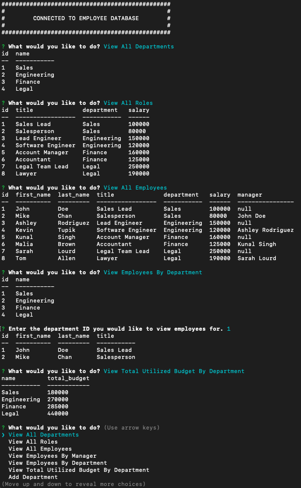

# SQL-Employee-Tracker

## Description

A command-line application that manages an employee database using Node.js, Inquirer, and MySQL.

## Table of Contents

&bull; [Installation](#installation) 
&bull; [Usage](#usage) 
&bull; [License](#license) 
&bull; [How to Contribute](#how-to-contribute) 
&bull; [Tests](#tests) 
&bull; [Questions](#questions)

## Installation

To use this application you’ll need to install [Node.js](https://nodejs.org/en/), the [MySQL2 package](https://www.npmjs.com/package/mysql2) to connect to your MySQL database and perform queries, the [Inquirer package](https://www.npmjs.com/package/inquirer) to interact with the user via the command line, and the [console.table package](https://www.npmjs.com/package/console.table) to print MySQL rows to the console.

## Usage

After launching the application, use the menu to execute any of the following tasks: view all departments, view all roles, view all employees, view employees by manager, view employees by department, view the total utilized budget of a department, add a department, add a role, add an employee, update an employee role, update employee managers, delete departments, delete roles, delete employees, or quit the application.    [Video: SQL Employee Tracker](https://google.com)

## License

Copyright © 2022, Michael Bartnett, edX Boot Camps LLC. Distributed under the [MIT](https://opensource.org/licenses/MIT) License. 

## How to Contribute

If you have a suggestion that would make this application better, please fork the repo and create a pull request.

## Tests

Test the application by typing "node index.js" in the command line while in the root directory.

## Questions

Contact: mbartnett@gmail.com, [github.com/mbartnett](https://github.com/mbartnett)    
